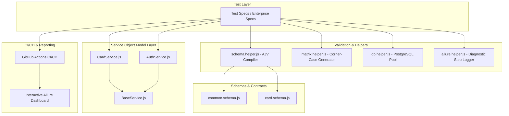

# 🚀 Enterprise Playwright API Automation Framework

A production-grade, highly scalable, and contract-validated API test automation framework built with **Playwright Test**, **JavaScript (Node.js)**, **AJV Schema Validator**, **PostgreSQL**, and **Allure Reporting**.

---

## 🌟 Architecture & 5 Enterprise Best Practices

This framework is built on **5 Industry-Standard Enterprise Principles**:



### 1. 🏛️ Service Object Model (Client / Facade Architecture)
- Centralized `tests/services/` layer (`BaseService`, `CardService`, `AuthService`).
- Decouples HTTP endpoints, headers, query parameters, and payload serialization from test assertions.
- URL changes or header updates are maintained in a single service file.

### 2. 📐 Contract Testing & JSON Schema Validation (AJV Engine)
- Integrated with `ajv` & `ajv-formats` for schema validation.
- Validates field types, required properties, and nullability against predefined schema contracts (`tests/schemas/`).
- Generates readable schema mismatch reports with field paths and expected types.

### 3. 🛡️ Data-Driven Matrix & Automated Corner-Case Generation
- Automated generators in `tests/helpers/matrix.helper.js`:
  - **Required Fields Matrix**: Iterates over base payloads missing one required field at a time (`400/422` validation).
  - **Type Mismatch Matrix**: Injects invalid types (Numbers, Arrays, Objects into string fields).
  - **Boundary & Whitespace**: Tests empty strings, whitespaces (`"   "`), nulls, and extreme character lengths (> 1000 chars).
  - **Security Payloads**: Automated SQL Injection (SQLi) & XSS attack vectors from `test-data.helper.js`.

### 4. 🗄️ Direct Database State Verification (PostgreSQL Integration)
- Built with `pg` connection pooling in `tests/helpers/db.helper.js`.
- Verifies database consistency (`findById`, `query`) and cleans up test artifacts (`cleanUpById`).
- Gracefully skips DB assertions when database credentials are not configured in `.env`.

### 5. 📊 Rich Allure Step Attachments & CI/CD Pipeline
- Every request and response payload is logged to Allure via `tests/helpers/allure.helper.js`.
- Automatic defect diagnostics and vulnerability flags on unexpected status codes.
- Ready for GitHub Actions (`.github/workflows/playwright.yml`) with automated Allure report deployment.

---

## 📁 Repository Structure

```text
├── .github/
│   └── workflows/
│       └── playwright.yml         # GitHub Actions CI/CD workflow
├── tests/
│   ├── services/                  # Service Object Model (API Client Layer)
│   │   ├── BaseService.js         # Base HTTP client with Allure logger
│   │   ├── CardService.js         # Cards API client
│   │   └── AuthService.js         # Authentication API client
│   ├── schemas/                   # JSON Schema Contracts (AJV)
│   │   ├── common.schema.js       # Standard Success / Error / Pagination schemas
│   │   └── card.schema.js         # Cards API schema contracts
│   ├── helpers/                   # Test Utilities & Engines
│   │   ├── schema.helper.js       # AJV compile & assertion helper
│   │   ├── matrix.helper.js       # Data-driven corner-case generator
│   │   ├── db.helper.js           # PostgreSQL connection pool & queries
│   │   ├── allure.helper.js       # Allure rich step attachment logger
│   │   ├── auth.helper.js         # Token caching & auth headers
│   │   └── test-data.helper.js    # Security payloads (SQLi, XSS, Boundary)
│   ├── cards-enterprise.spec.js   # Enterprise Test Suite (All 5 Processes)
│   ├── cards.spec.js              # Cards full lifecycle & security tests
│   ├── response-validation.spec.js# Universal response schema & time tests
│   └── full-suite/                # Exhaustive domain-specific test suites
├── scripts/
│   └── generate-allure.js         # Allure report generation script
├── playwright.config.js           # Playwright runner configuration
├── package.json                   # Dependencies & execution scripts
├── .env.example                   # Environment configuration template
└── README.md                      # Framework documentation
```

---

## ⚙️ Setup & Configuration

### 1. Install Dependencies
```bash
npm install
```

### 2. Environment Configuration (`.env`)
Create a `.env` file from `.env.example`:
```bash
cp .env.example .env
```

Configure your environment variables:
```env
# Target API Base URL
BASE_URL=https://zk2a6jfr01.execute-api.ap-southeast-5.amazonaws.com

# Default App Headers
CUSTOM_LANG=en
APP_VERSION=1.1.9
PLATFORM=android

# PostgreSQL Credentials (Optional - for Direct DB Verification)
DB_HOST=127.0.0.1
DB_PORT=5432
DB_NAME=mycoifeur_db
DB_USER=postgres
DB_PASSWORD=your_password
```

## 🚦 Running Tests

### 1. Run Complete User Registration & Admin Verification E2E Circle:
```bash
npm run test:e2e-user
```

### 2. Run Complete Provider (Salon) Registration & Admin Approval E2E Circle:
```bash
npm run test:e2e-provider
```

### 3. Run Complete User Booking & Lifecycle Journey (Card, Wallet, Home, Salon, User Cancel, Provider Accept/Reject):
```bash
npm run test:e2e-booking
```
> Covers:
> - **Scenario 1**: New User ➔ Home Address ➔ Saved Card Payment (`MasterCard`) ➔ Tap Webhook Paid Confirmation
> - **Scenario 2**: New User ➔ Wallet Balance ➔ In-Salon Location ➔ Paid via Wallet Balance
> - **Scenario 3**: User cancels an existing order (`PATCH /api/v1/orders/:id/cancel`)
> - **Scenario 4**: Provider accepts an existing order (`GET /api/v1/salon/orders/:id/artist_accept`)
> - **Scenario 5**: Provider rejects an existing order (`POST /api/v1/salon/orders/:id/artist_reject`)

### 4. Run Enterprise Test Suite (5 Processes Showcase):
```bash
npm run test:enterprise
```

### 5. Run All Tests (2,450+ Test Cases):
```bash
npx playwright test
```

### 6. Run by Module / Scope:
```bash
npm run test:auth      # Authentication tests (Login, OTP, Register, Password)
npm run test:user      # User Profile, Address, Orders, Cart tests
npm run test:cards     # Payment Cards lifecycle & security tests
npm run test:guest     # Public/Guest services, salons, configs
npm run test:salon     # Salon management & order processing
npm run test:admin     # Admin dashboard & management tests
npm run test:advanced  # Architecture & infrastructure tests
```

### 5. Run in Debug or Headed Mode:
```bash
npm run test:debug     # Step-through Playwright inspector
npm run test:headed    # Headed test execution
```

---

## 📈 Generating & Viewing Reports

### 1. Clean Previous Results:
```bash
npm run clean:results
```

### 2. Run Tests & Generate Allure Report:
```bash
npx playwright test
npm run allure:generate
```

### 3. Open Allure Interactive Dashboard:
```bash
npm run allure:open
```

---

## ✍️ How to Write an Enterprise Test

Here is an example demonstrating the Service Object Model, AJV Schema validation, and the Matrix helper:

```javascript
const { test, expect } = require('@playwright/test');
const { getUserToken } = require('./helpers/auth.helper');
const { CardService } = require('./services/CardService');
const { expectSchema } = require('./helpers/schema.helper');
const { singleCardResponseSchema } = require('./schemas/card.schema');
const { generateMissingFieldCases } = require('./helpers/matrix.helper');

let cardService;

test.beforeAll(async ({ request }) => {
    const token = await getUserToken(request);
    // Initialized per test in beforeEach or using helper
});

test.beforeEach(async ({ request }) => {
    cardService = new CardService(request, userToken);
});

// 1. Positive Test with Contract Validation
test('Add card and validate JSON Schema', async ({}, testInfo) => {
    const payload = {
        cardNumber: '4111222233334444',
        cardholderName: 'John Doe',
        expiryDate: '12/28',
        cvv: '123',
    };

    const res = await cardService.createCard(payload, testInfo);
    expect([200, 201]).toContain(res.status());

    const json = await res.json();
    // Strict schema assertion:
    expectSchema(json, singleCardResponseSchema, {
        title: 'Create Card Contract',
        testInfo,
    });
});

// 2. Data-Driven Required Field Matrix
const requiredCases = generateMissingFieldCases(basePayload, ['cardNumber', 'cardholderName', 'expiryDate', 'cvv']);
for (const tc of requiredCases) {
    test(`[Matrix] ${tc.description} → 422`, async ({}, testInfo) => {
        const res = await cardService.createCard(tc.payload, testInfo);
        expect([400, 422]).toContain(res.status());
    });
}
```

---

## 🔄 CI/CD Pipeline (GitHub Actions)

The repository includes an enterprise workflow in `.github/workflows/playwright.yml`:
- **Workflow Dispatch (Manual Trigger)**: Select individual modules (`all`, `enterprise`, `cards`, `auth`, `user`, `salon`, `admin`, `guest`).
- **Parallelized Test Execution**: Fast headless execution on Ubuntu runners.
- **Automated Allure Artifacts**: Allure HTML report is automatically published to GitHub Pages.
